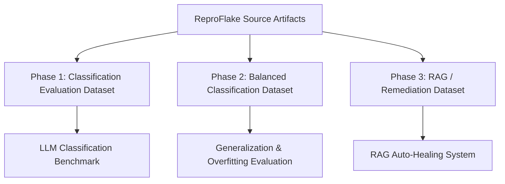
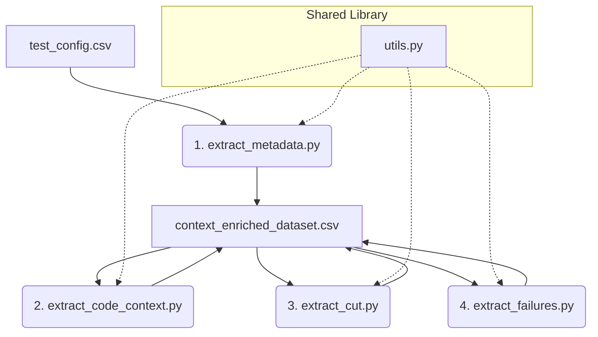
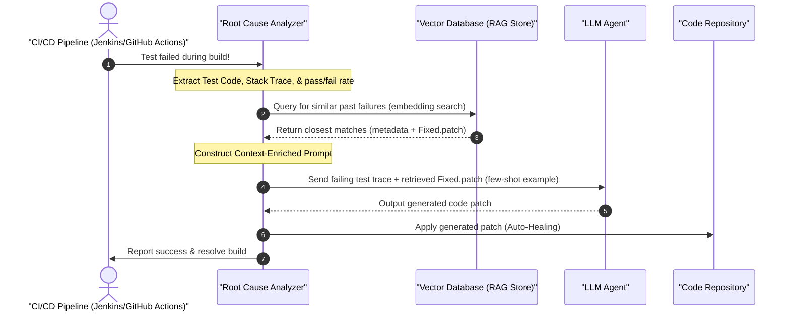

# CAFlake Research Plan: Context-Augmented Flaky Test Identification, Classification & Auto-Remediation

This document details the high-level research protocol and system architecture for the **CAFlake** framework, built using the **ReproFlake** replication package.

---

## 1. Research Overview & Motivation

Statically classifying flaky tests using only the test method's source code is fundamentally limited. As shown by Rahman et al. (OOPSLA 2025) and Berndt et al. (2026), zero-shot LLMs perform barely above random guessing ($MCC \approx 0.27$) when deprived of context, while fine-tuned models overfit to dataset-specific vocabulary shortcuts (e.g. memorizing words like `sleep` or `thread`).

The **CAFlake** framework solves this information bottleneck by:
1.  Extracting a context-enriched classification evaluation benchmark.
2.  Augmenting the classification dataset with stable control groups to evaluate generalization (Balanced Dataset).
3.  Populating a separate RAG database containing JIRA reports and Git patches to drive automated remediation (RAG development).

---

## 2. Overall Research Dataset Architecture

We divide our data extraction into three separate, isolated dataset folders to prevent data leakage during classification evaluation and keep the codebase clean.

### Dataset Phase Specifications

#### Phase 1: Classification Evaluation Dataset (`dataset-pipeline/`)
*   **Purpose**: Evaluation benchmark to measure how well classifiers/LLMs statically identify flakiness and classify its category using structured context.
*   **Schema**:
    *   `test_id` & `flaky_category` (`id`, `od`, `td`, `nio`).
    *   `flaky_test_code` (source body) & `flaky_helper_methods_json` (invoked utilities).
    *   `flaky_code_under_test_json` (dynamic production methods covered via JaCoCo).
    *   `flaky_failures_json` (stack traces, exception types, and messages).
    *   `flaky_passes`, `flaky_failures`, `flaky_errors` (execution metrics).
    *   `fixed_version` equivalents (for contrastive analysis).

#### Phase 2: Balanced / Mixed Classification Dataset (`dataset-pipeline-balanced/`)
*   **Purpose**: Balanced benchmark containing both flaky and stable sibling tests to combat class imbalance bias.
*   **Schema**:
    *   All entries from Phase 1.
    *   Stable test method bodies extracted from the same test classes and parent classes, with `flaky_category` set to `"stable"`.

#### Phase 3: RAG / Auto-Remediation Dataset (`dataset-pipeline-rag/`)
*   **Purpose**: Knowledge base to populate a Vector Database, serving as a retrieval source for auto-healing.
*   **Schema**:
    *   `test_id` (foreign key to link with the evaluation dataset).
    *   `flaky_issue_description`: JIRA/Github bug report (`issue_description.txt`).
    *   `flaky_fix_patch`: Unified code diff patch (`Fixed.patch`).

---

## 3. Phase 1 Modular Pipeline Architecture

To ensure the pipeline is clean, maintainable, and publishable, the extraction is divided into **four separate scripts** sharing a core utility library. Each script operates as a pipeline stage that reads the shared CSV file, extracts its specific category of information, updates the relevant columns, and saves the file back.

### Module Responsibilities

1.  **`utils.py` (Core Library)**: Contains shared functions for brace-counting, comments/string stripping, zip file caching, JIRA metadata mapping, and unified CSV read/write utilities.
2.  **`extract_metadata.py` (Stage 1)**: Initializes `context_enriched_dataset.csv`. Joins repository URLs and commit SHAs, and extracts passes, failures, and errors counts from `summary.txt`.
3.  **`extract_code_context.py` (Stage 2)**: Reads the CSV, parses the target test files from ZIPs, and extracts the test code and sibling helper methods for both Flaky and Fixed versions.
4.  **`extract_cut.py` (Stage 3)**: Reads the CSV, parses the `coverage_results.csv` logs, maps covered classes to ZIP main sources (resolving inner classes and constructors), and extracts the production Code Under Test.
5.  **`extract_failures.py` (Stage 4)**: Reads the CSV, parses failing iterations and stack traces from Surefire reports and console test logs, groups/deduplicates them, and writes the clean stack trace and proxy-normalized traces.

---

## 4. The RAG Auto-Remediation Runtime Architecture

Once your datasets are compiled, this sequence diagram shows the runtime execution workflow inside your CI/CD pipeline:

---

## 5. Execution Milestones

*   **Milestone 1 (Current Step)**: Implement Phase 1 modular extraction pipeline (`utils.py` + 4 stages) in `dataset-pipeline/` and compile the flaky dataset CSV.
*   **Milestone 2**: Implement stable sibling test extraction and compile Phase 2 balanced dataset in `dataset-pipeline-balanced/`.
*   **Milestone 3**: Extract Phase 3 JIRA issue reports and code patch diffs to `dataset-pipeline-rag/` (RAG Knowledge Base).

