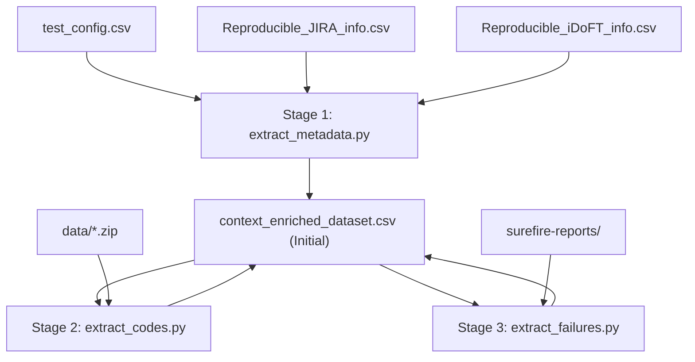

# Implementation Plan: Context-Enriched Flaky Test Dataset Extraction (Phase 1)

This plan details the design and implementation of a modular data extraction pipeline for the **CAFlake** framework (Phase 1 classification benchmark). 

Rather than running a single monolithic script, we divide the data extraction into **three independent stages**. Each stage is implemented by a dedicated, publishable script that reads from, enriches, and writes back to a single shared CSV file at `CAFlake/context_enriched_dataset.csv`.

---

## Shared CSV Schema

All pipeline stages read and update `CAFlake/context_enriched_dataset.csv` using the following schema:

| Column Name | Stage | Description |
| :--- | :--- | :--- |
| `id` | Stage 1 | Consecutive integer ID (1, 2, ...). |
| `test_id` | Stage 1 | Unique container ID for the test case (e.g., `fastjson97ee7b6test_for_issue5`). |
| `flaky_category` | Stage 1 | Category of flakiness (e.g., `Implementation Dependent`, `Order Dependent`, `Non-Idempotent`, `Time Dependent`). |
| `repo_url` | Stage 1 | Git repository remote origin URL. |
| `flaky_commit` | Stage 1 | Git SHA of the flaky commit. |
| `fixed_commit` | Stage 1 | Git SHA of the fixed commit. |
| `flaky_test_code` | Stage 2 | Extracted test method source code (flaky version). |
| `flaky_helper_methods_json` | Stage 2 | Referenced local/parent helper methods in JSON format (flaky version). |
| `flaky_failure_log` | Stage 3 | Plain text log of unique deduplicated stack traces/error logs with failure counts (flaky version). |

---

## Proposed Changes & Stage Implementations

All scripts reside in [CAFlake/data-extraction-scripts/](file:///d:/university%20works/Final-Year_Firts_sem/FYP/INFO/DataSet/ReproFlake-C9E6/CAFlake/data-extraction-scripts/).



### 1. Stage 1: Metadata Extraction
*   **Script**: [extract_metadata.py](file:///d:/university%20works/Final-Year_Firts_sem/FYP/INFO/DataSet/ReproFlake-C9E6/CAFlake/data-extraction-scripts/metadata-extractor/extract_metadata.py)
*   **Columns Updated**: `id`, `test_id`, `flaky_category`, `repo_url`, `flaky_commit`, `fixed_commit`.
*   **Logic**: Parses `test_config.csv` and cross-references JIRA/iDoFT info maps to retrieve Git metadata.

### 2. Stage 2: Test & Helper Code Extraction
*   **Script**: [extract_codes.py](file:///d:/university%20works/Final-Year_Firts_sem/FYP/INFO/DataSet/ReproFlake-C9E6/CAFlake/data-extraction-scripts/code-extractor/extract_codes.py)
*   **Columns Updated**: `flaky_test_code`, `flaky_helper_methods_json`.
*   **Logic**: For each record, opens the corresponding project source ZIP. Locates the class name, parses the test method body using Java/Groovy brace counting, traverses parent classes if inherited, and extracts local helper methods called by the test.

### 3. Stage 3: Run Time Failure Logs Extraction
*   **Script**: [extract_failures.py](file:///d:/university%20works/Final-Year_Firts_sem/FYP/INFO/DataSet/ReproFlake-C9E6/CAFlake/data-extraction-scripts/failure-extractor/extract_failures.py) [NEW]
*   **Columns Updated**: `flaky_failure_log`.
*   **Location**: The script will reside in a new folder at `CAFlake/data-extraction-scripts/failure-extractor/`.
*   **Comment Constraint**: Standard Python `#` comments will be strictly used throughout the script. No triple-quoted string comments (`"""..."""`) will be used, to prevent string parsing errors.
*   **Logic**:
    1. Cross-reference `test_config.csv` to map each `test_id` to its fully qualified test class name and method name.
    2. Scan all execution rounds inside the project's surefire results path: `result/[test_id]/result/Flaky/surefire-reports/reports-[round]/`.
    3. Locate the text report file `[ClassName].txt` (which contains the execution output for that round).
    4. Search for the flaky test method's execution entry (e.g., matching the method name ending in `<<< FAILURE!` or `<<< ERROR!`).
    5. Parse the exception class, detailed error message, and the full multi-line stack trace.
    6. Deduplicate identical failure traces across all rounds. Keep track of how many rounds each unique failure occurred in.
    7. For each unique failure mode, format a header like `Failed Rounds: X/Y` followed by its stack trace. Join multiple unique failure modes with a blank line.
    8. Write the final deduplicated plain-text log into the `flaky_failure_log` column.

---

## Log Extraction Example

### 1. Surefire Report File (`org.apache.accumulo.core.util.shell.ShellSetInstanceTest.txt`):
```text
-------------------------------------------------------------------------------
Test set: org.apache.accumulo.core.util.shell.ShellSetInstanceTest
-------------------------------------------------------------------------------
Tests run: 2, Failures: 1, Errors: 0, Skipped: 0, Time elapsed: 0.864 s <<< FAILURE! - in org.apache.accumulo.core.util.shell.ShellSetInstanceTest
org.apache.accumulo.core.util.shell.ShellSetInstanceTest.testSetInstance_HdfsZooInstance_Explicit  Time elapsed: 0.072 s  <<< FAILURE!
java.lang.AssertionError: 

  Unexpected method call ClientConfiguration.containsKey("instance.dfs.dir"):
	at org.easymock.internal.MockInvocationHandler.invoke(MockInvocationHandler.java:44)
	at org.easymock.internal.ObjectMethodsFilter.invoke(ObjectMethodsFilter.java:85)
	at org.apache.accumulo.core.conf.SiteConfiguration.get(SiteConfiguration.java:67)
```

### 2. Extracted Deduplicated Log (`flaky_failure_log`):
```text
Failed Rounds: 10/10
java.lang.AssertionError: Unexpected method call ClientConfiguration.containsKey("instance.dfs.dir"):
	at org.easymock.internal.MockInvocationHandler.invoke(MockInvocationHandler.java:44)
	at org.easymock.internal.ObjectMethodsFilter.invoke(ObjectMethodsFilter.java:85)
	at org.apache.accumulo.core.conf.SiteConfiguration.get(SiteConfiguration.java:67)
```

---

## Verification Plan

### Stage-by-Stage Verification
We verify the extraction using limit runs first to confirm the schema columns update correctly.
```powershell
# 1. Metadata
python CAFlake/data-extraction-scripts/metadata-extractor/extract_metadata.py --limit 5

# 2. Test Code & Helpers
python CAFlake/data-extraction-scripts/code-extractor/extract_codes.py --limit 5

# 3. Failure Logs
python CAFlake/data-extraction-scripts/failure-extractor/extract_failures.py --limit 5
```

### Full-Scale Execution
```powershell
python CAFlake/data-extraction-scripts/metadata-extractor/extract_metadata.py
python CAFlake/data-extraction-scripts/code-extractor/extract_codes.py
python CAFlake/data-extraction-scripts/failure-extractor/extract_failures.py
```
*(All scripts support a `--force` flag to overwrite existing entries in case re-extraction is desired).*
